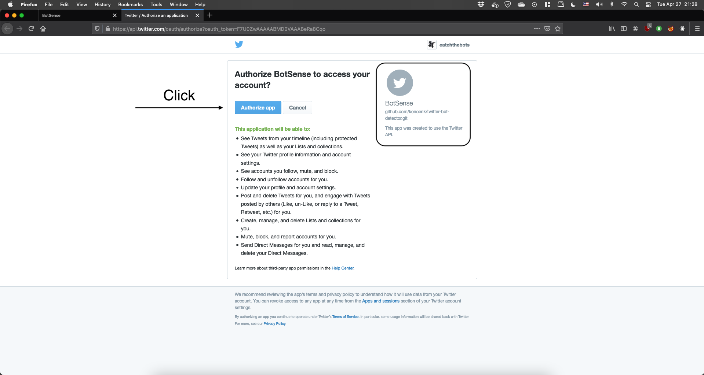
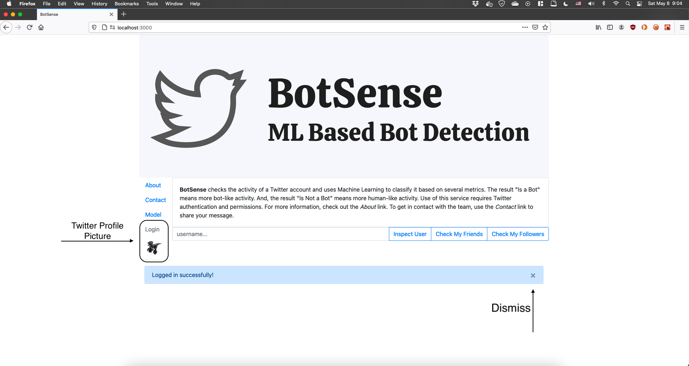
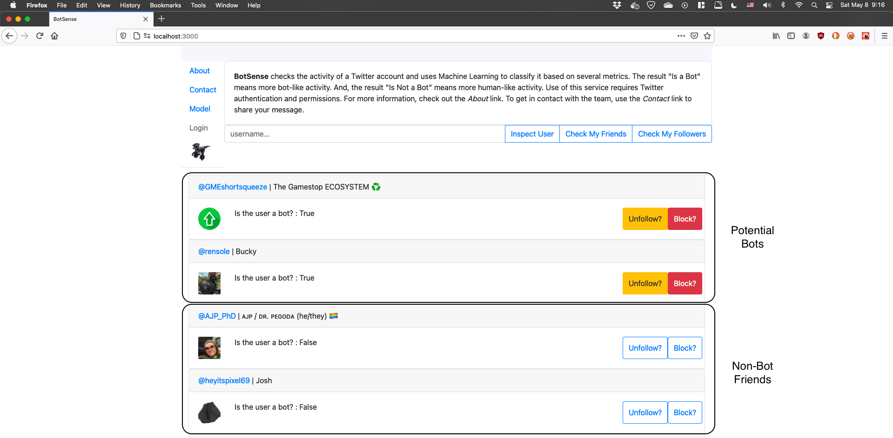
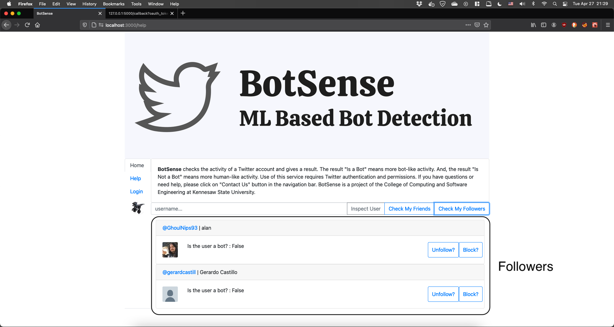
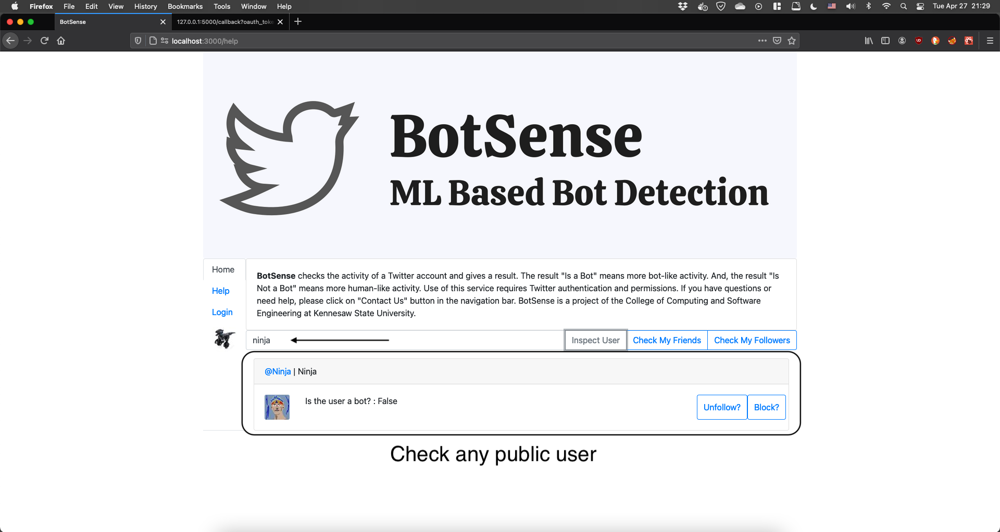
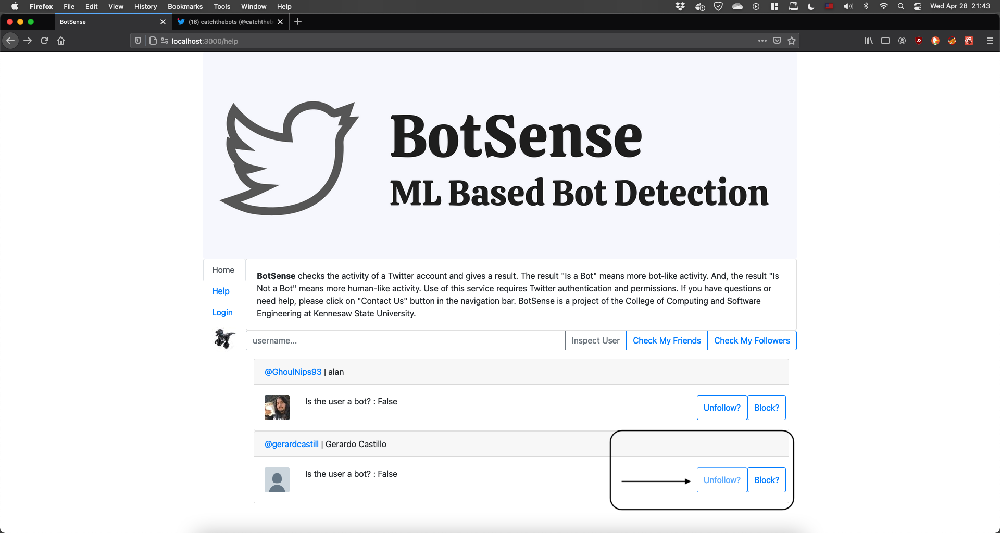
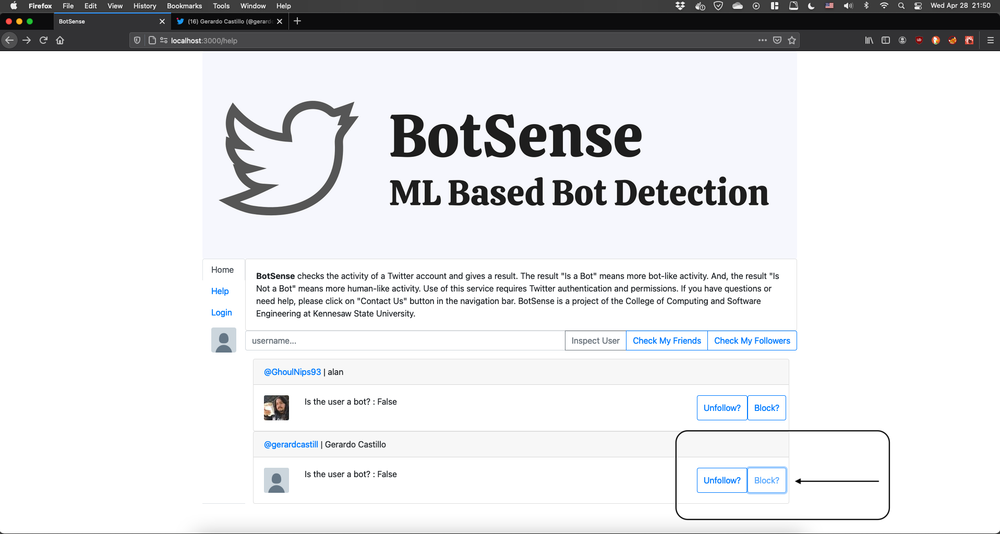

# BotSense User Manual

## Table of Contents

1. UI Overview
2. Authorizing Access
3. Inspecting Users
4. User Actions

## 1. User Interface Overview

The application is using a grid layout and has the following components:

* Logo
* Side Bar / Navigation Bar
* Information box
* Actions bar
* Results Area

## 2. Authorizing Access

In order to use the application, you need a Twitter account. Furthermore, you need to allow BotSense to access your Twitter account. This is done via an authorization mechanism provided by Twitter itself and can be revoked at any time from the profile page.

To authorize access to your profile follow the steps below:

1. From the Side Bar, click on the `Login` button. This will open a new tab on your browser.

2. On the new tab, log in to Twitter, ensure the request for authorization is issued from `BotSense` and click `Authorize`

   

3. Upon successful authorization, you will receive a message from the server (this is temporarily indicating succesful completion of the step). Feel free to close the new tab at this point and return to the application.

   

4. Going back at the application tab, note that the account profile picture is retrieved on the bottom side of the Navigation Bar. This indicates BotSense can succesfully retrieve information from your account and make all the necessary calls.

   

## 3. Inspecting Users

There are three different user categories that you are able to inspect using BotSense:

* *friends* (people whom you follow)
* *followers* (people that follow you)
* *public users*

These are accessible from the Actions Bar and produce the following:

* A list of one-or-more users in the Results Area
* The user's profile picture, their name as well as their screen name which links to their Twitter profile page
* A classification of the user being detected as a bot or not a bot
* An option to unfollow the user
* An option to block the user

### Check My Friends

1. Ensure you are logged in and have authorized access to BotSense
2. From the Actions Bar, click `Check My Friends`
3. Notice the results in the Results Area

### Check My Followers

1. Ensure you are logged in and have authorized access to BotSense
2. From the Actions Bar, click `Check My Followers`
3. Notice the results in the Results Area

### Inspect A Public User

1. Ensure you are logged in and have authorized access to BotSense
2. From the Actions Bar, enter a Twitter username in the form (this can be in `username` or `@username` format)
3. Notice the result in the Results Area

## 4. User Actions

As seen above, for each result there are two main actions with respect to the user:

* *Unfollow* -- this action removes the specified user from your follower's list
* *Block* -- this action removes the specified user from your follower's list and prevents them to follow you again in the future.

### Unfollow User

1. Once you have obtained the user list, click the `Unfollow?` button for the selected user.

2. Observe the button has changed state to disabled, indicating the action cannot be issued again on the same user

3. Optionally, you can click on the user's link (@user) and check from Twitter itself that the user is now available to be followed again.

   

### Block User

1. Once you have obtained the user list, click the `Block?` button for the selected user.

2. Observe the button has changed state to disabled, indicating the action cannot be issued again on the same user

3. Optionally, you can click on the user's link (@user) and check from Twitter itself that the user is now marked as blocked. You can undo this action from the same page, to unblock the user.

   

